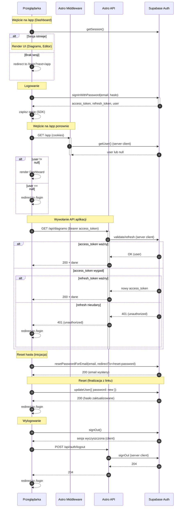

<authentication_analysis>

Przepływy autentykacji (na podstawie @.ai/prd.md i @.ai/auth-spec.md):

1) Rejestracja (e‑mail + hasło, opcjonalna weryfikacja e‑mail):
   - Przeglądarka wywołuje Supabase Auth: signUp.
   - Jeśli wymagana weryfikacja e‑mail → status „pending”, link aktywacyjny.
   - Po potwierdzeniu e‑mail (lub bez wymogu) użytkownik posiada sesję lub
     zostaje przekierowany do logowania.

2) Logowanie (e‑mail + hasło):
   - Przeglądarka wywołuje Supabase Auth: signInWithPassword.
   - Supabase zwraca sesję: access_token + refresh_token.
   - Sesja przechowywana po stronie klienta (SDK) i/lub w cookies (server client).

3) Sprawdzenie sesji (SessionGuard + Middleware):
   - SessionGuard (client) pyta Supabase o bieżącą sesję.
   - Jeśli brak sesji → redirect do /login (z parametrem next).
   - Middleware (server) tworzy klienta serwerowego Supabase i wstawia
     locals.supabase (i docelowo locals.user) na podstawie cookies.

4) Dostęp do API aplikacji przez Astro API:
   - Przeglądarka wysyła żądania do Astro API.
   - Jeśli zalogowany, dołącza Authorization: Bearer <access_token>.
   - Astro API może użyć server clienta Supabase do weryfikacji/odświeżenia
     sesji i przekazania tożsamości dalej.

5) Odświeżanie tokenu:
   - SDK Supabase automatycznie odświeża access_token za pomocą refresh_token.
   - Po stronie serwera (middleware/API) server client zarządza cookies i też
     może odświeżyć sesję.
   - Gdy refresh się nie powiedzie → użytkownik traci sesję (401) i trafia
     na /login.

6) Reset hasła:
   - Przeglądarka wywołuje resetPasswordForEmail → e‑mail z linkiem.
   - Po wejściu w link (tymczasowa sesja), użytkownik ustawia nowe hasło
     przez updateUser; następnie redirect do /login.

7) Wylogowanie:
   - Przeglądarka wywołuje signOut (SDK) oraz opcjonalnie /api/auth/logout,
     żeby wyczyścić cookies po stronie serwera.
   - Użytkownik trafia na /login.

Aktorzy i interakcje:
- Przeglądarka (React + SDK Supabase) – formularze, SessionGuard, redirecty.
- Middleware (Astro) – server client Supabase, locals.supabase/user.
- Astro API – punkty końcowe, które weryfikują/odświeżają sesję i przyjmują
  Bearer; dalej komunikują się z backendem .NET (poza zakresem tego diagramu).
- Supabase Auth – rejestracja, logowanie, reset, sesje, odświeżanie tokenów.

Weryfikacja i odświeżanie tokenów:
- Weryfikacja dostępu w UI (SessionGuard) i w Astro API (server client).
- Autoodświeżanie tokenu przez SDK oraz przez server client (cookies).
- Brak/wygaśnięcie/niepowodzenie odświeżenia → 401 i redirect na /login.

Skrócony opis kroków:
- signUp/signIn: ustanowienie sesji (access + refresh tokeny).
- SessionGuard: gating dostępu do /app.
- API z Bearer: przekazanie tożsamości do warstwy serwerowej.
- Refresh: cichy mechanizm przedłużający sesję; w razie błędu wymusza login.
- Reset hasła: dwa etapy (wysyłka linku + ustawienie nowego hasła).
- Logout: usunięcie sesji po stronie klienta i serwera.

</authentication_analysis>

<mermaid_diagram>

</mermaid_diagram>
