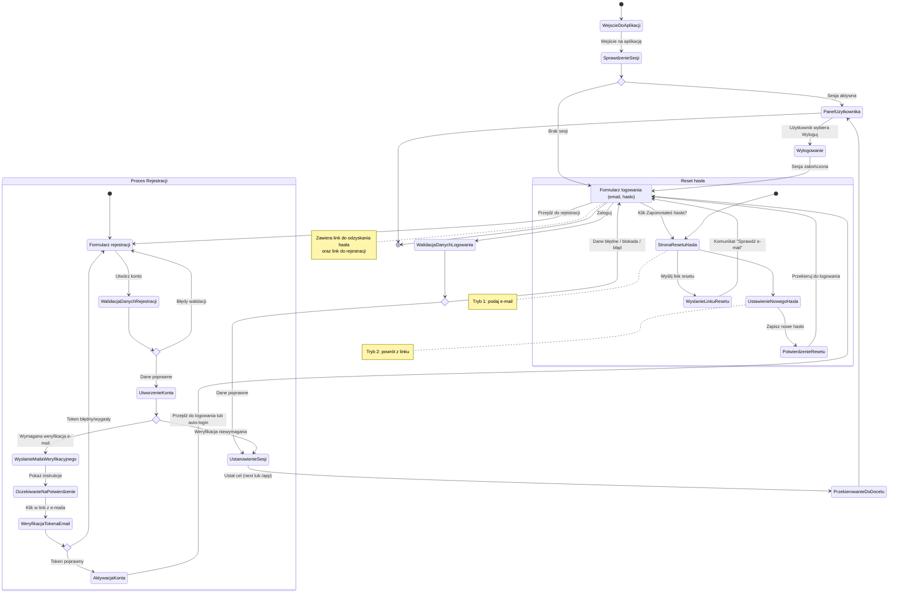

# Podróż użytkownika — moduł autentykacji

<user_journey_analysis>
1) Ścieżki użytkownika (z PRD i specyfikacji auth):
- Rejestracja: wypełnienie formularza → walidacja → utworzenie konta → (opcjonalnie) weryfikacja e‑mail → zalogowanie/przekierowanie.
- Logowanie: formularz logowania → walidacja → ustanowienie sesji → przekierowanie do docelowej strony (next) lub /app.
- Odzyskiwanie hasła: inicjacja resetu (podanie e‑mail) → wysłanie linku → powrót z linku → ustawienie nowego hasła → przekierowanie do logowania.
- Dostęp do aplikacji bez sesji: próba wejścia na /app → sprawdzenie sesji → przekierowanie do /login.
- Dostęp do stron auth przy aktywnej sesji: wejście na /login lub /register będąc zalogowanym → przekierowanie do /app.
- Wylogowanie: akcja wyloguj → zakończenie sesji → przekierowanie do /login.

2) Główne podróże i stany:
- Wejście do aplikacji i kontrola dostępu (Sprawdzenie sesji, Strona logowania, Panel użytkownika).
- Proces logowania (Formularz logowania, Walidacja, Komunikaty błędów, Ustanowienie sesji, Przekierowanie).
- Proces rejestracji (Formularz rejestracji, Walidacja, Utworzenie konta, Weryfikacja e‑mail — opcjonalna, Aktywacja konta/Zalogowanie).
- Proces resetu hasła (Podanie e‑mail, Wysłanie linku, Ustawienie nowego hasła, Potwierdzenie, Przekierowanie).
- Wylogowanie (Zakończenie sesji, Przekierowanie do logowania).

3) Punkty decyzyjne i alternatywne ścieżki:
- Czy istnieje aktywna sesja? → Tak: Panel; Nie: Logowanie.
- Logowanie: dane poprawne czy błędne? → Poprawne: sesja + redirect; Błędne: komunikat i ponowna próba.
- Rejestracja: dane poprawne? → Nie: błędy i poprawki; Tak: czy wymagana weryfikacja e‑mail? → Tak: oczekiwanie na potwierdzenie z linku; Nie: bezpośrednie zalogowanie/przekierowanie.
- Reset hasła: czy powrót z linku zawiera ważny token? → Tak: ustaw nowe hasło; Nie: komunikat o błędnym/wygasłym linku i ponowna inicjacja.
- Wejście na strony auth z aktywną sesją? → Tak: redirect do /app; Nie: pozostanie na stronie auth.

4) Krótki opis stanów:
- WejścieDoAplikacji: start podróży użytkownika.
- SprawdzenieSesji: weryfikacja, czy użytkownik jest zalogowany.
- StronaLogowania: formularz e‑mail + hasło, link do resetu, link do rejestracji.
- WalidacjaDanychLogowania: sprawdzenie poprawności danych i odpowiedź z komunikatami.
- UstanowienieSesji: utworzenie aktywnej sesji po poprawnym logowaniu.
- PrzekierowanieDoDocelu: przeniesienie na stronę docelową (next) lub do /app.
- PanelUzytkownika: główny obszar aplikacji (dashboard) dostępny po zalogowaniu.
- StronaRejestracji: formularz e‑mail + hasło + akceptacja regulaminu.
- WalidacjaDanychRejestracji: weryfikacja pól i reguł haseł.
- UtworzenieKonta: założenie konta; możliwe wymaganie weryfikacji e‑mail.
- WyslanieMailaWeryfikacyjnego: wysyłka linku do potwierdzenia adresu.
- OczekiwanieNaPotwierdzenie: informacja dla użytkownika o sprawdzeniu skrzynki.
- WeryfikacjaTokenaEmail: obsługa wejścia z linku weryfikacyjnego.
- AktywacjaKonta: potwierdzenie konta i przejście do logowania lub automatyczne zalogowanie.
- StronaResetuHasla: ekran resetu (tryb: podaj e‑mail lub ustaw nowe hasło po linku).
- WyslanieLinkuResetu: informacja o wysłaniu linku na e‑mail.
- UstawienieNowegoHasla: formularz nowego hasła po powrocie z linku.
- PotwierdzenieResetu: komunikat o powodzeniu i przekierowanie do logowania.
- Wylogowanie: zakończenie sesji i powrót do logowania.
</user_journey_analysis>

<mermaid_diagram>

</mermaid_diagram>
