# Architektura UI modułu autentykacji

<architecture_analysis>
1) Komponenty i pliki istotne dla autentykacji (z repo i spec):
- Strony Astro (nowe wg spec): `login.astro`, `register.astro`, `reset-password.astro` (opcjonalnie `auth/callback.astro`).
- Layouty: `Layout.astro` (istniejący), `AuthLayout.astro` (nowy — uproszczony dla stron auth).
- Komponenty React (nowe wg spec): `LoginForm.tsx`, `RegisterForm.tsx`, `RequestResetForm.tsx`, `SetNewPasswordForm.tsx`, (opcjonalnie) `AuthProvider.tsx`.
- Komponenty istniejące: `SessionGuard.tsx` (do rozszerzenia), `Toaster.tsx`, shadcn/ui (`input.tsx`, `button.tsx`, `card.tsx`, `alert-dialog.tsx`, `textarea.tsx`).
- Strona aplikacji: `app.astro` (Dashboard: `DiagramsPanel`, `EditorPanel`).
- SDK i integracje: `src/db/supabase.client.ts` (Supabase client), `src/middleware/index.ts` (locals.supabase), Supabase config/migrations (RLS, `auth.users`).
- Backend .NET: planowana weryfikacja Bearer JWT (Program.cs – TODO), repozytorium Supabase i kolumna `user_id`.

2) Główne strony i odpowiadające im komponenty:
- `/login.astro` → `LoginForm` (+ link do resetu), `Toaster`, layout `AuthLayout`.
- `/register.astro` → `RegisterForm` (+ checkbox regulaminu), `Toaster`, layout `AuthLayout`.
- `/reset-password.astro` → `RequestResetForm` (bez tokenu) lub `SetNewPasswordForm` (z tokenem), `Toaster`, layout `AuthLayout`.
- `/app.astro` (Dashboard) → opakowane w `SessionGuard`; zawiera `DiagramsPanel` i `EditorPanel` (bez zmian domenowych).

3) Przepływ danych (wysoki poziom):
- Formularze auth (React) → Supabase Auth (SDK) → ustawienie/odświeżenie sesji w przeglądarce → `SessionGuard` sprawdza sesję → redirect do `/login` przy braku, render dzieci przy obecnej.
- Po zalogowaniu UI wywołuje endpointy aplikacji; docelowo żądania do .NET przekazują nagłówek `Authorization: Bearer <access_token>`.
- Middleware Astro utrzymuje serwerowy klient Supabase w `locals.supabase` (oraz docelowo `locals.user`).

4) Krótkie opisy funkcjonalności:
- `AuthLayout.astro`: lekki layout dla ekranów logowania/rejestracji/resetu (kontener formularzy, bez nawigacji dashboardu).
- `LoginForm`: logowanie przez `supabase.auth.signInWithPassword`, obsługa błędów i redirect do `next`/`/app`.
- `RegisterForm`: rejestracja przez `supabase.auth.signUp` (+ walidacja Zod i akceptacja regulaminu); opcjonalna weryfikacja e‑mail.
- `RequestResetForm`: wysłanie maila resetu przez `resetPasswordForEmail`.
- `SetNewPasswordForm`: ustawienie nowego hasła po wejściu w link; `supabase.auth.updateUser`.
- `SessionGuard` (aktualizacja): sprawdza `supabase.auth.getSession()` na `client:load`, zarządza stanami i przekierowaniami.
- `Toaster`: globalne powiadomienia (błędy, sukcesy).
- shadcn/ui: budulec formularzy (inputy, przyciski, karty, dialogi).

```mermaid
flowchart TD
  %% Klasy stylów
  classDef updated fill:#fff3cd,stroke:#d39e00,stroke-width:1.5px;
  classDef page fill:#e8f4ff,stroke:#2b6cb0;
  classDef layout fill:#f0fff4,stroke:#2f855a;
  classDef react fill:#fdf2f8,stroke:#b83280;
  classDef sdk fill:#f7fafc,stroke:#4a5568;
  classDef shared fill:#faf5ff,stroke:#6b46c1;

  %% Layouty
  subgraph L["Layouty"]
    L1["Layout.astro"]:::layout
    L2["AuthLayout.astro (nowy)"]:::layout
  end

  %% Strony
  subgraph P["Strony (Astro)"]
    P1["/login.astro"]:::page
    P2["/register.astro"]:::page
    P3["/reset-password.astro"]:::page
    P4["/app.astro (Dashboard)"]:::page
  end

  %% Komponenty autentykacji
  subgraph A["Komponenty autentykacji (React)"]
    A1["LoginForm"]:::react
    A2["RegisterForm"]:::react
    A3["RequestResetForm"]:::react
    A4["SetNewPasswordForm"]:::react
    A5["SessionGuard (rozszerzony)"]:::react
  end

  %% Komponenty aplikacji (Dashboard)
  subgraph D["Komponenty aplikacji (Dashboard)"]
    D1["DiagramsPanel"]:::react
    D2["EditorPanel"]:::react
  end

  %% Stan/SDK i współdzielone
  subgraph S["Stan i SDK"]
    S1["SupabaseClient (browser)"]:::sdk
    S2["Middleware Astro (locals.supabase)"]:::sdk
    S3["(opcjonalnie) AuthProvider"]:::sdk
  end

  subgraph U["Komponenty współdzielone (UI)"]
    U1["input"]:::shared
    U2["button"]:::shared
    U3["card"]:::shared
    U4["alert-dialog"]:::shared
    U5["textarea"]:::shared
    U6["Toaster"]:::shared
  end

  %% Powiązania stron z layoutami
  P1 --> L2
  P2 --> L2
  P3 --> L2
  P4 --> L1

  %% Zawartość stron auth
  P1 --> A1
  P1 --> U6
  P2 --> A2
  P2 --> U6
  P3 --> A3
  P3 --> A4
  P3 --> U6

  %% Dashboard chroniony
  P4 --> A5
  A5 ==> D1
  A5 ==> D2

  %% Formularze korzystają z UI współdzielonego
  A1 -.używa.-> U1
  A1 -.używa.-> U2
  A1 -.używa.-> U3
  A2 -.używa.-> U1
  A2 -.używa.-> U2
  A2 -.używa.-> U3
  A3 -.używa.-> U1
  A3 -.używa.-> U2
  A4 -.używa.-> U1
  A4 -.używa.-> U2

  %% Przepływy autentykacji (wysoki poziom)
  A1 -- signInWithPassword --> S1
  A2 -- signUp --> S1
  A3 -- resetPasswordForEmail --> S1
  A4 -- updateUser(password) --> S1

  %% SessionGuard sprawdza sesję
  A5 -- getSession --> S1
  A5 -.brak sesji.-> R1((Redirect do /login))
  R1 -.powrót z next.-> P1

  %% Middleware serwerowe (Astro)
  S2 --- S1
  S3 --- S1

  %% Po zalogowaniu – dostęp do Dashboardu
  S1 -.stan sesji.-> A5

  %% Wyróżnienia aktualizowanych elementów
  class A5 updated;
```

</architecture_analysis>

<mermaid_diagram>

</mermaid_diagram>
