# Deployment Architecture - DigitalOcean App Platform

## Overview

This document describes the production deployment architecture on DigitalOcean App Platform.

## Architecture Diagram

```mermaid
graph TB
    User[👤 User Browser]
    
    subgraph "DigitalOcean App Platform"
        subgraph "Frontend Service (Public)"
            FrontendStatic[Astro Static Pages<br/>HTML/CSS/JS]
            FrontendAPI[Astro API Routes<br/>/api/*]
        end
        
        subgraph "Backend Service (Internal)"
            BackendAPI[.NET Web API<br/>Port 8080]
        end
        
        FrontendAPI -->|http://backend:8080| BackendAPI
    end
    
    subgraph "External Services"
        Supabase[(Supabase<br/>PostgreSQL + Auth)]
        GHCR[GitHub Container<br/>Registry]
    end
    
    User -->|HTTPS GET /| FrontendStatic
    User -->|HTTPS POST/GET /api/*| FrontendAPI
    
    BackendAPI -->|Connection String| Supabase
    FrontendStatic -->|Auth| Supabase
    
    GHCR -.->|Pull Images| FrontendStatic
    GHCR -.->|Pull Images| BackendAPI
    
    style FrontendStatic fill:#4CAF50
    style FrontendAPI fill:#2196F3
    style BackendAPI fill:#FF9800
    style Supabase fill:#9C27B0
    style GHCR fill:#607D8B
```



## Request Flow Examples

### Static Page Request

1. User requests `https://your-app.ondigitalocean.app/`
2. DigitalOcean routes to **Frontend Service**
3. Astro serves static HTML/CSS/JS
4. Browser renders the page

### API Request Flow

1. User's browser makes request: `POST /api/diagrams`
2. DigitalOcean routes to **Frontend Service** (Astro API Route)
3. Astro API route at `src/pages/api/diagrams/index.ts`:
   - Extracts auth token from session
   - Forwards request to `http://backend:8080/diagrams`
4. **Backend Service** (.NET API):
   - Validates JWT token
   - Processes business logic
   - Queries Supabase PostgreSQL
   - Returns response
5. Astro API route forwards response back to user

### Authentication Flow

1. User logs in via frontend
2. Frontend uses Supabase Auth SDK
3. Supabase returns JWT token
4. Token stored in session (httpOnly cookie)
5. Astro API routes extract token from session
6. Token forwarded to backend in `Authorization: Bearer {token}` header
7. Backend validates token using JWT secret from Supabase

## Services Configuration

### Frontend Service

- **Type:** Docker container (Node.js + Astro)
- **Image:** `ghcr.io/michal-kozlik/sudoku-solver-frontend:{sha}`
- **Port:** 8080
- **Public Routes:** `/` (all paths)
- **Purpose:**
  - Serve static Astro/React application
  - Handle authentication with Supabase
  - Proxy API requests to backend
  - Session management

### Backend Service

- **Type:** Docker container (.NET 9 ASP.NET Core)
- **Image:** `ghcr.io/michal-kozlik/sudoku-solver-backend:{sha}`
- **Port:** 8080
- **Public Routes:** None (internal only)
- **Internal Hostname:** `backend`
- **Purpose:**
  - Business logic and data processing
  - Direct PostgreSQL database access
  - Sudoku solving algorithms
  - JWT token validation

## Environment Variables

### Frontend Service

| Variable | Type | Description |
|----------|------|-------------|
| `NODE_ENV` | Plain | Always `production` |
| `HOST` | Plain | `0.0.0.0` (bind to all interfaces) |
| `PORT` | Plain | `8080` |
| `PUBLIC_SUPABASE_URL` | Secret | Supabase project URL |
| `PUBLIC_SUPABASE_KEY` | Secret | Supabase anonymous key |
| `BACKEND_URL` | Plain | `http://backend:8080` |

### Backend Service

| Variable | Type | Description |
|----------|------|-------------|
| `ASPNETCORE_ENVIRONMENT` | Plain | `Production` |
| `ASPNETCORE_URLS` | Plain | `http://0.0.0.0:8080` |
| `SUPABASE_CONNECTION_STRING` | Secret | PostgreSQL connection string |
| `Jwt__Secret` | Secret | JWT signing secret |
| `Jwt__Issuer` | Plain | Supabase auth issuer URL |
| `Jwt__Audience` | Plain | `authenticated` |

## Networking

### Internal Communication

- Frontend can reach backend via: `http://backend:8080`
- Backend can reach frontend via: `http://frontend:8080` (if needed)
- Services are in the same private network
- No public internet traffic between services

### Public Access

- **Frontend:** Publicly accessible via HTTPS
  - Main domain: `https://{app-name}.ondigitalocean.app`
  - Custom domains: (if configured)
- **Backend:** NOT publicly accessible
  - Only reachable from frontend service

## Security Layers

1. **Network Isolation**
   - Backend has no public routes
   - Only frontend can access backend

2. **Authentication**
   - Supabase handles user authentication
   - JWT tokens validate requests
   - Frontend manages session cookies (httpOnly)

3. **Authorization**
   - Backend validates JWT on every request
   - User ID extracted from token claims
   - Row-level security via user ID

4. **Secrets Management**
   - All secrets stored in DigitalOcean App Platform
   - Secrets injected as environment variables at runtime
   - Never committed to git

## Health Checks

### Frontend Health Check
- **Path:** `/`
- **Initial Delay:** 30 seconds
- **Interval:** 10 seconds
- **Timeout:** 5 seconds

### Backend Health Check
- **Path:** `/health`
- **Initial Delay:** 30 seconds
- **Interval:** 10 seconds
- **Timeout:** 5 seconds
- **Response:** `{"status":"healthy","timestamp":"...","version":"1.0.0"}`

## CI/CD Pipeline

### GitHub Actions Workflow

1. **Trigger:** Push to `master` branch
2. **Build Stage:**
   - Build Docker images for frontend and backend
   - Tag with commit SHA and `latest`
   - Push to GitHub Container Registry (GHCR)
3. **Deploy Stage:**
   - Update `.do/app.yaml` with new image tags
   - Deploy to DigitalOcean via `doctl` CLI
   - Wait for deployment to complete
   - Report status

### Image Registry

- **Registry:** GitHub Container Registry (ghcr.io)
- **Frontend Image:** `ghcr.io/michal-kozlik/sudoku-solver-frontend`
- **Backend Image:** `ghcr.io/michal-kozlik/sudoku-solver-backend`
- **Tags:**
  - `{full-sha}` - Specific commit (e.g., `a1b2c3d4e5f6...`)
  - `latest` - Latest master build

## Resource Allocation

### Current Configuration

- **Frontend:**
  - Instance Size: `basic-xxs` (512MB RAM, 0.5 vCPU)
  - Instance Count: 1
  
- **Backend:**
  - Instance Size: `basic-xxs` (512MB RAM, 0.5 vCPU)
  - Instance Count: 1

### Scaling Considerations

To handle more traffic, increase:
1. **Instance Count** (horizontal scaling)
2. **Instance Size** (vertical scaling)
   - `basic-xs`: 1GB RAM, 1 vCPU
   - `basic-s`: 2GB RAM, 1 vCPU
   - `basic-m`: 4GB RAM, 2 vCPU

## Monitoring

### DigitalOcean Dashboard

- CPU usage per service
- Memory usage per service
- Request metrics
- Deployment history

### Application Logs

Access via:
```bash
# Runtime logs
doctl apps logs {APP_ID} --type run

# Build logs
doctl apps logs {APP_ID} --type build

# Specific service
doctl apps logs {APP_ID} --type run --component frontend
```

## Cost Optimization

### Current Estimate

- Frontend: `basic-xxs` × 1 = ~$5/month
- Backend: `basic-xxs` × 1 = ~$5/month
- **Total:** ~$10/month

### Tips

1. Use `basic-xxs` for low-traffic apps
2. Enable auto-scaling only if needed
3. Monitor resource usage regularly
4. Consider shared databases for dev/staging

## Disaster Recovery

### Backup Strategy

1. **Database:** Supabase handles PostgreSQL backups
2. **Code:** Version controlled in GitHub
3. **Configuration:** `.do/app.yaml` in git
4. **Secrets:** Documented in password manager

### Rollback Procedure

1. Identify last working commit SHA
2. Update `.do/app.yaml` with old image tags
3. Redeploy: `doctl apps update {APP_ID} --spec .do/app.yaml`

### Or trigger GitHub Actions manually with specific commit

## Troubleshooting

See [DEPLOYMENT.md](../DEPLOYMENT.md) for detailed troubleshooting steps.

## References

- [DigitalOcean App Platform Docs](https://docs.digitalocean.com/products/app-platform/)
- [App Spec Reference](https://docs.digitalocean.com/products/app-platform/reference/app-spec/)
- [GitHub Container Registry](https://docs.github.com/en/packages)
